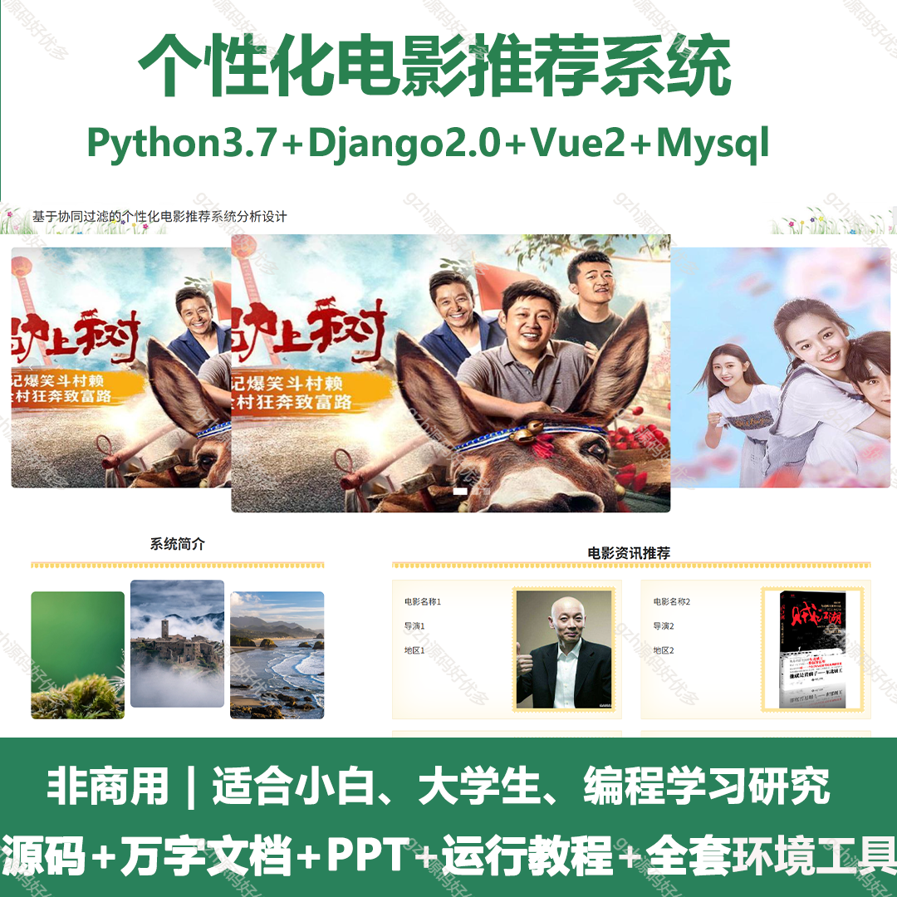
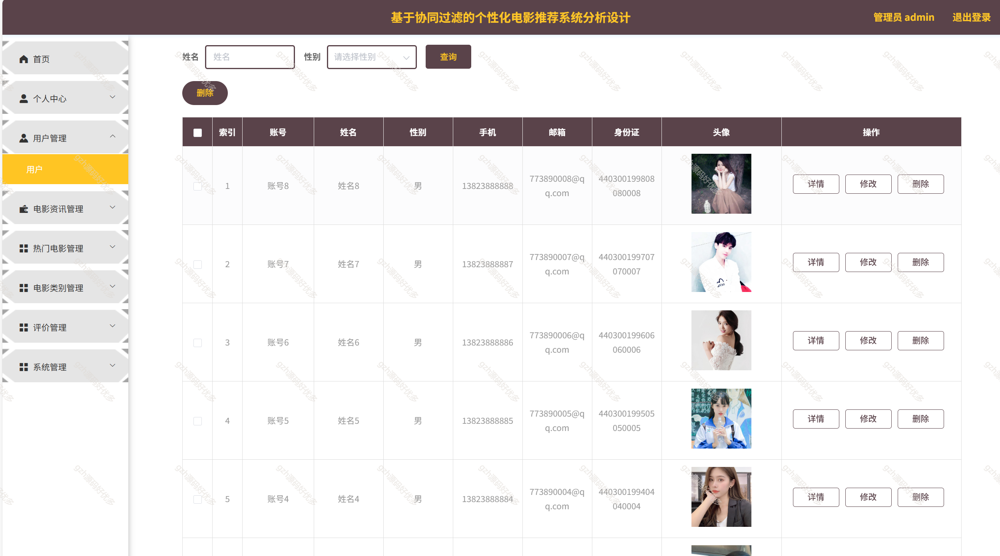
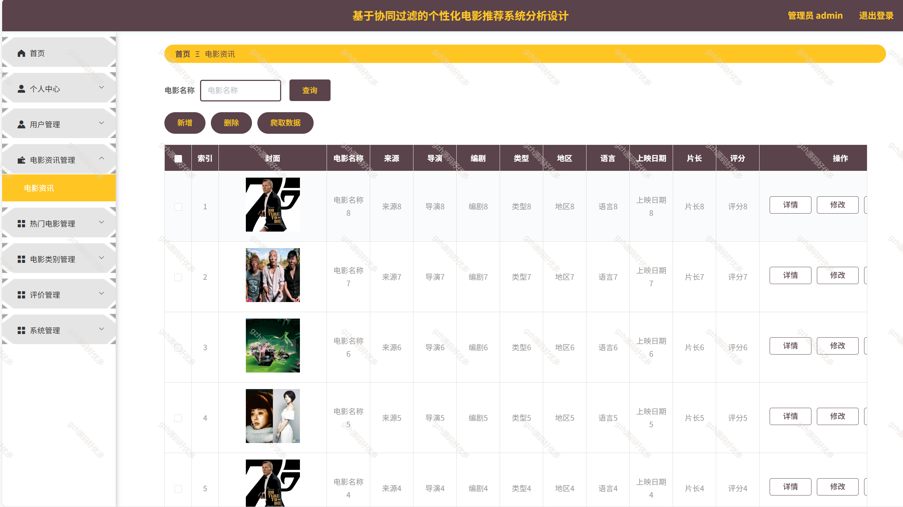
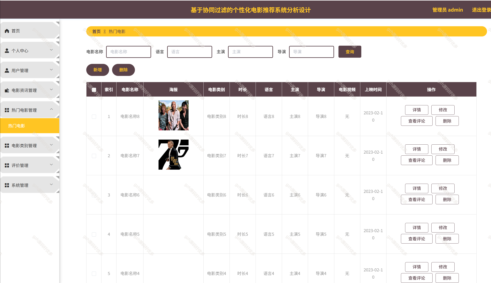
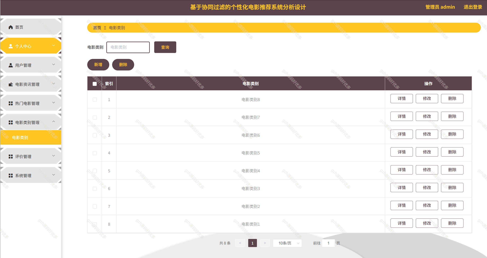
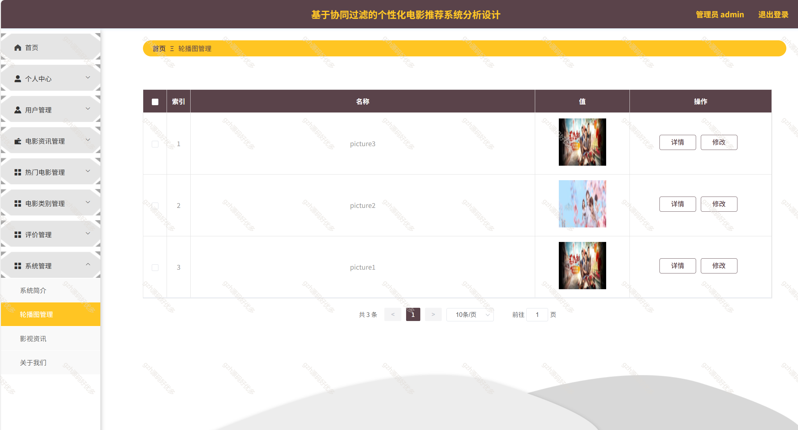
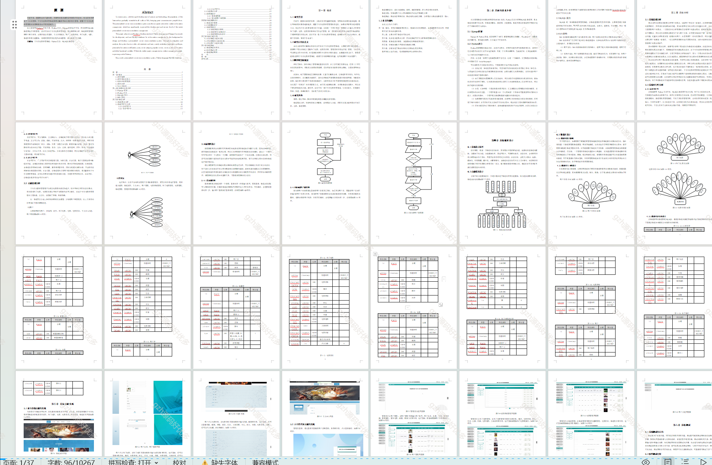

# python044
python044基于Python+Django协同过滤的个性化电影推荐系统
 
## 查看主页获取源码

### 一、关键词
个性化电影推荐系统，过滤个性化电影推荐系统

### 二、作品包含
源码+数据库+万字文档+PPT+全套环境和工具资源+部署教程

### 三、项目技术
前端技术：Vue2.0、Element-ui
后端技术：Python3.7、Django2.0

### 四、运行环境（以下版本亲测，其他版本未知，请自测）
开发工具：PyCharm + VSCODE

数据库：MySQL5.7（最低要5.7版本）

数据库管理工具：Navicat10+

Python：Python3.7

前端Nodejs：14

浏览器：谷歌浏览器

### 五、项目介绍
项目编号：python044

近些年来，随着科技的飞速发展，互联网的普及逐渐延伸到各行各业中，给人们生活带来了十分的便利，个性化电影推荐系统利用计算机网络实现信息化管理，使整个个性化电影推荐管理的发展和服务水平有显著提升。

系统拥有管理员和用户两个角色，主要具备注册登录、个人信息修改、用户、电影类别、热门电影、电影、系统信息等功能模块

### 六、运行截图

